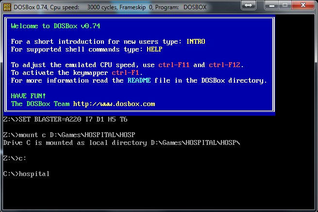

主题医院DOS原版进入方法
=======================
使用DOSBox在Dos下玩主题医院是窗口模式, 方便于截图。而且不会有由于切换到桌面导致作弊码失效的Bug。

如何使用DOSBox进入主题医院的说明
--------------------------------
DOSBox是一款在Windows下模拟Dos环境, 从而玩Dos游戏的工具。

假设你的游戏目录是 ``D:/games/HOSPITAL/HOSP``

那么DOSBox下将游戏挂载到 ``C盘`` 的命令是: 

.. code-block:: console

	mount c D:/games/HOSPITAL/HOSP

然后输入下面的命令进入C盘: 

.. code-block:: console

	C:

然后运行可执行程序:

.. code-block:: console

	hospital

即相当于执行了 ``hospital.exe``, 从而开始游戏了。

**请注意**: 如果你已经挂载了一个虚拟C盘, 是不能再挂载其他目录的。这时候你需要输入如下命令卸载C盘镜像, 之后重复使用前面的方法即可挂载其他目录:

.. code-block:: console
	
	mount -u C