主题医院主要房间优化布局
========================

一般诊断室
----------
一般诊断室的暖气有卡位作用

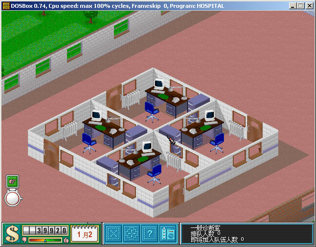

高级诊断室
----------
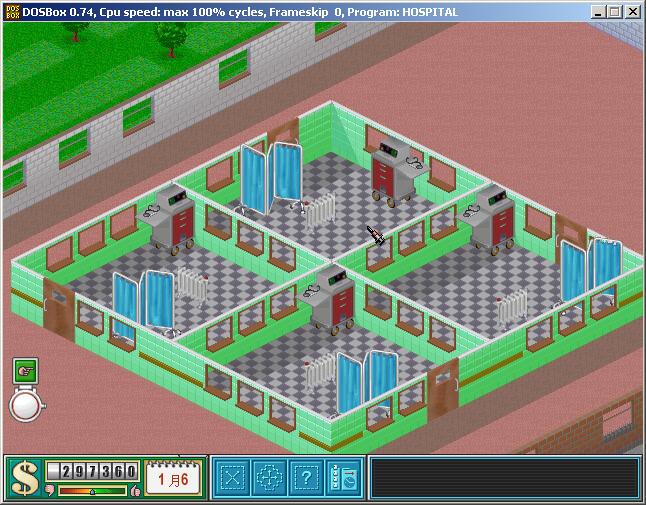

扫描仪室
----------
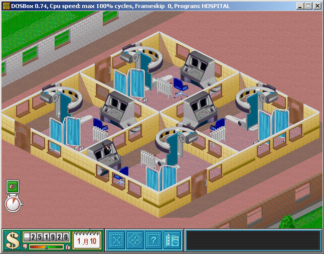

精神病诊疗室
----------
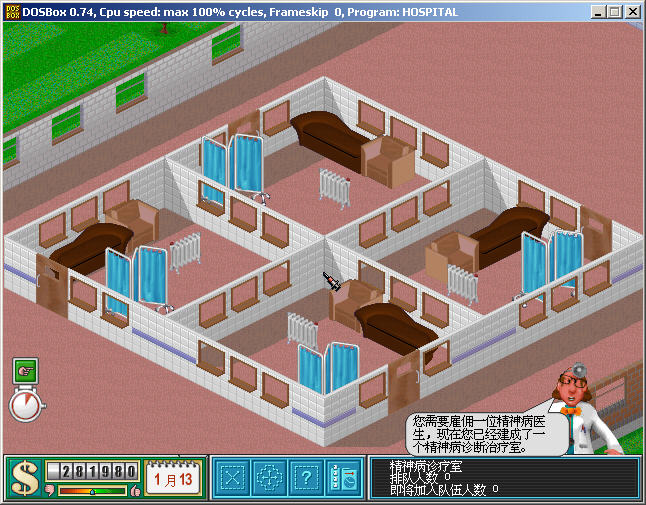

药房
----------
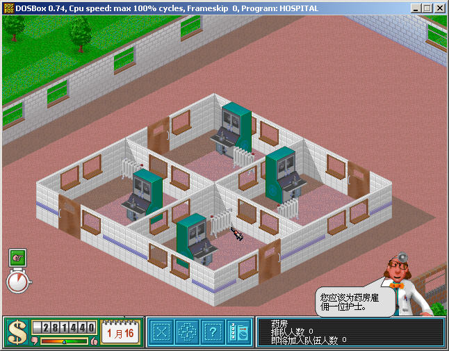

充气机
----------
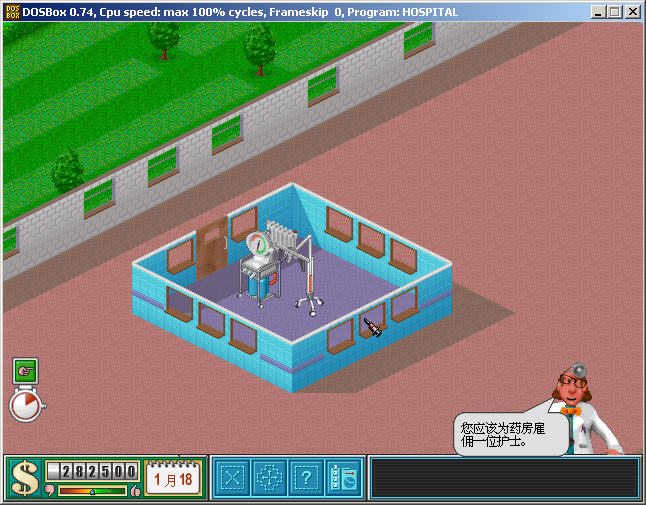

毛发恢复机
----------
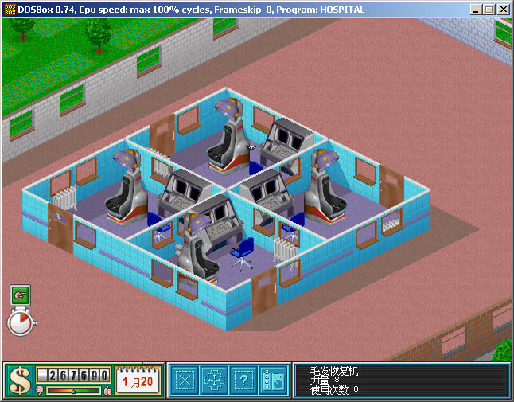

舌头治疗机
----------
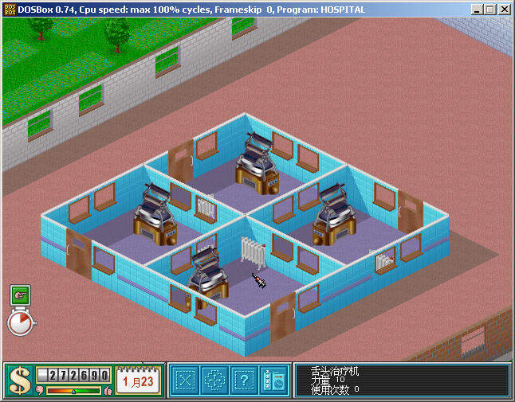

骨折诊所
----------
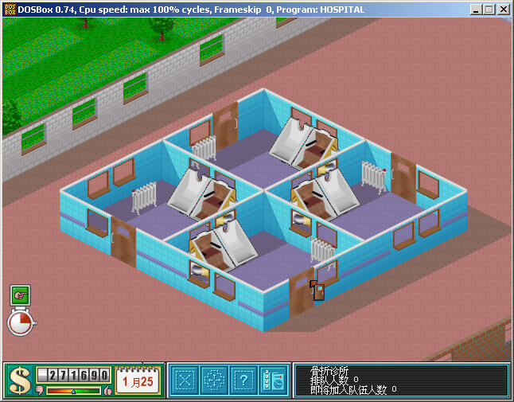

电分解诊所
----------
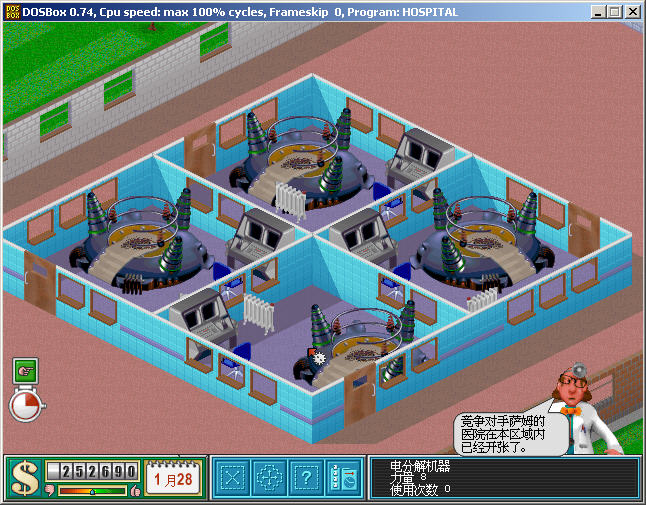

胶桶诊所
----------
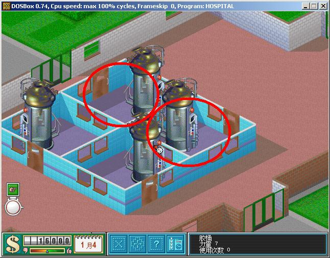

净化设备
----------
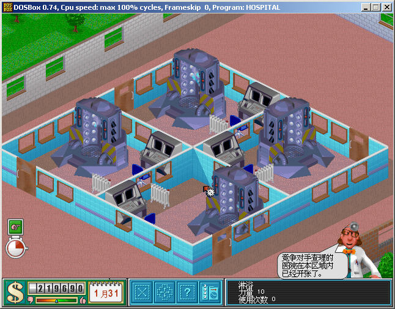

DNA修复装置
----------
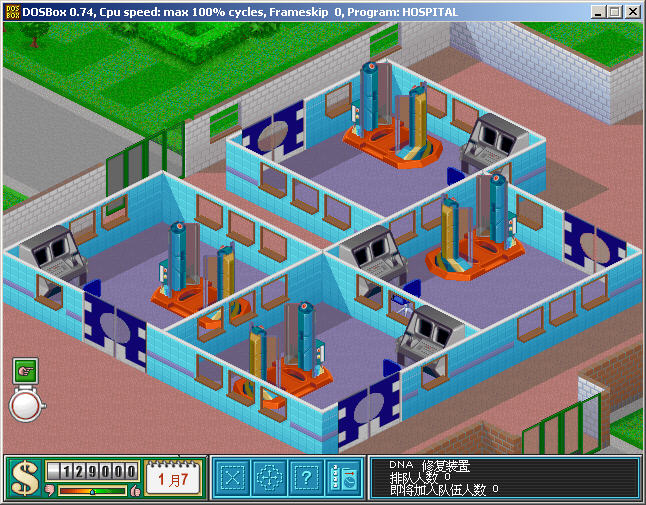

手术中心
----------
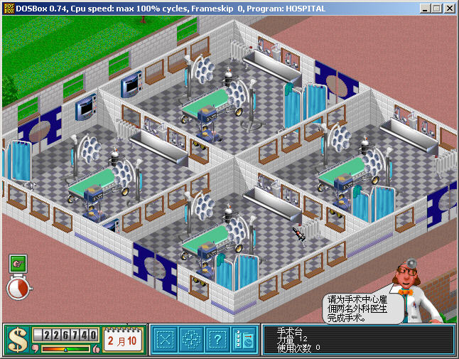

休息室
----------
基本建造思路都是一样，多放小休息室效率最高

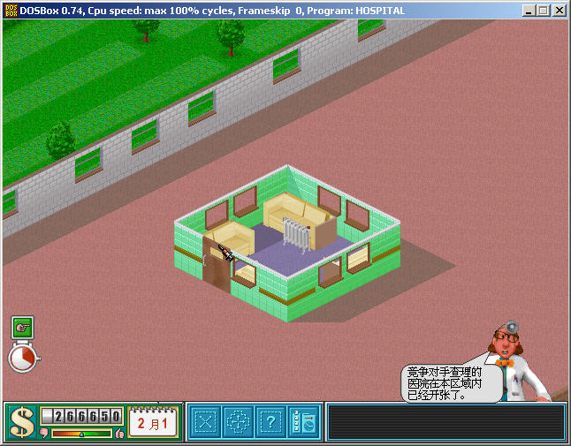

培训室
----------
基本格局就是这样，可以自己改动门的朝向。注意放映机必须正面对着学员坐位，不然对学员心情和培训速度有极大影响。

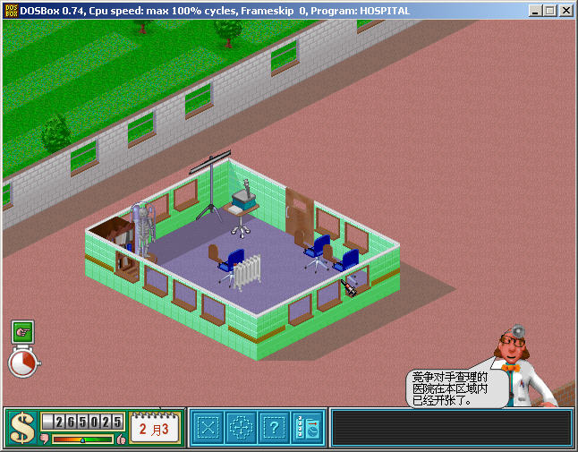