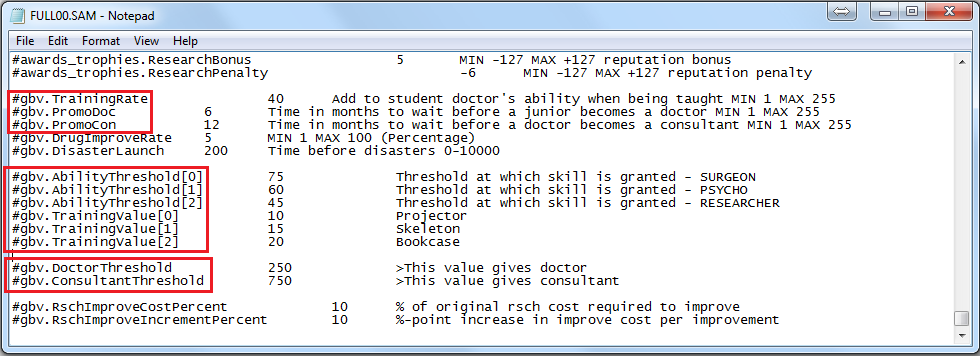

培训原理探求以及快速培训法
==========================
首先，经过分析Level文件夹下的配置文件，可得如下参数的含义：

- #gbv.TrainingRate: 一个月内增加的能力值, 最小1, 最大255
- #gbv.PromoDoc: 最少需要等多少个月才能从实习医生晋升为医生
- #gbv.PromoCon: 最少需要等多少个月才能从医生晋升为专家

- #gbv.AbilityThreshold[0]: 要获得外科手术技能所需的能力值
- #gbv.AbilityThreshold[1]: 要获得精神病手术技能所需的能力值
- #gbv.AbilityThreshold[2]: 要获得研究技能所需的能力值
- #gbv.TrainingValue[0]: 医生每进行一次幻灯机操作增加的能力值
- #gbv.TrainingValue[1]: 医生每进行一次人体模型操作增加的能力值
- #gbv.TrainingValue[2]: 医生每进行一次书架操作增加的能力值

以下两个属性与 TrainingRate, PromoDoc, PromoCon 相关

- #gbv.DoctorThreshold: 至少要达到多少能力值才能晋升为医生
- #gbv.ConsultantThreshold: 至少要达到多少能力值才能晋升为专家

然后，经过观察，专家讲师在培训中心的动作流程是这样的：

1. 走到幻灯机那里。
2. 拉下背景布，打开幻灯机，放上幻灯片，此时屏幕亮起。
3. 拿起教杆，反复的指指点点一段时间，每完成一次整体操作，增加一次 ``TrainingValue[0]`` 里定义的能力值。
4. 如果有书柜或人体模型，则会走到人体模型处指指点点，增加一次 ``TrainingValue[1]`` 或 ``TrainingValue[2]`` 里定义的能力值。
5. 每过一个月，医生则会增加 ``TrainingRate`` 里的点数，当达到一定的月数和积攒到一定的能力值, 则会触发相应的晋升。

快速培训法
----------
根据以上分析， 快速培训的的关键就是缩短专家缓慢的培训动作。

第一阶段，专家站到幻灯机那里，将鼠标放在专家身上，在专家拉下幻灯机背景布后，会打开幻灯机，然后会放上幻灯片，接着是拿教杆。就在放好幻灯片拿教杆的空当，点鼠标右键，把专家抓起，然后右移一格，把专家放下。（右移一格的原因是因为，原地抓起是没法放到原地的）。放下后，专家会继续去拉下背景布，等放好幻灯片后，再将专家抓起，右移一格放下。就这样重复操作，不用几次就会提示完成一项能力培训。直到成为三能力医生。**该原理是因为当专家放好幻灯片后，屏幕变亮后即算一次培训周期，之后的动作就没有什么用了**。

第二阶段，培训的医生虽然是三能力，但是技能值（雇佣医生列表中排在士气、疲劳程度后边的绿色条的“技能”） 不高，升为专家的速度就慢。可以从雇佣医生列表中找技能值高的专家继续培训（可以是没有这三种能力的专家，只要技能值高即可），仍然这样操作。结果三能力的医生要么在培训室升为专家，要么出去工作后不久就升为专家。 